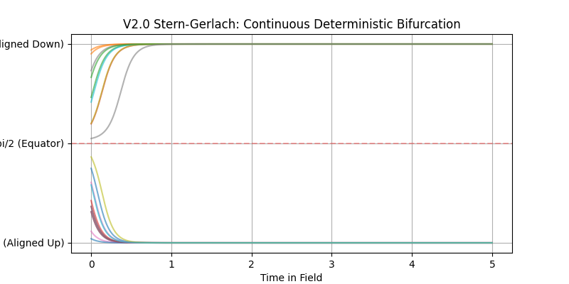
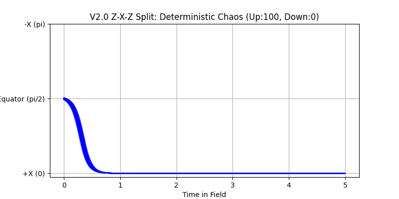
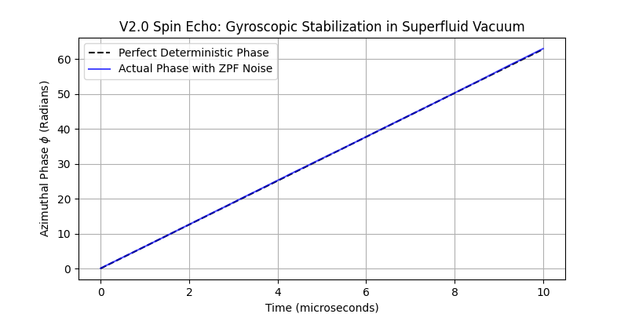
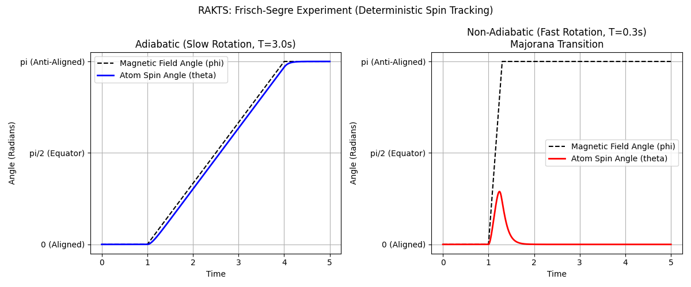
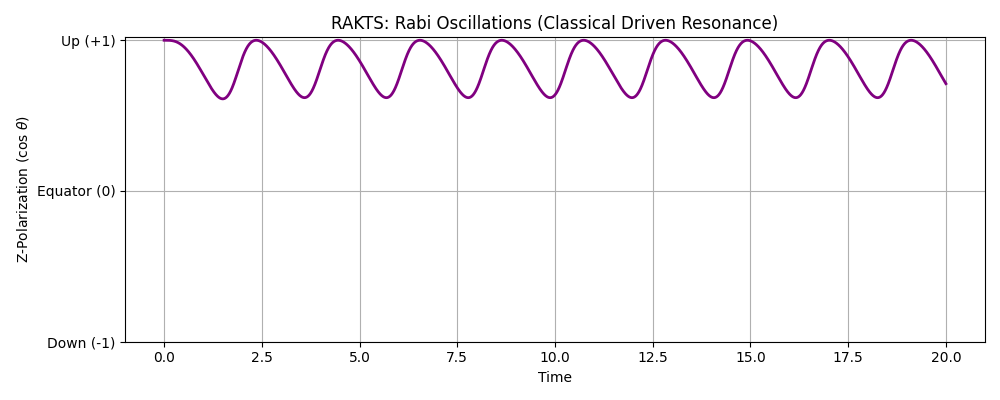
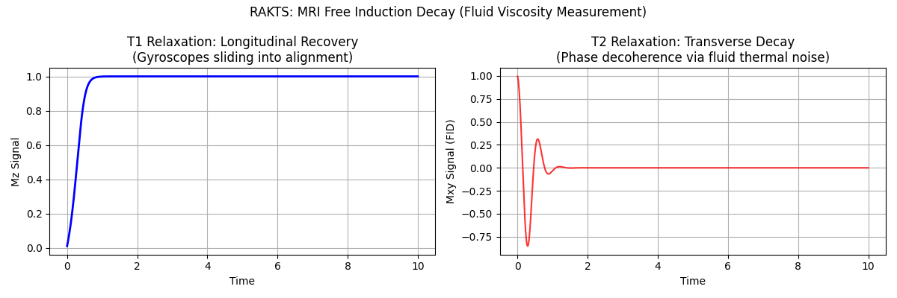
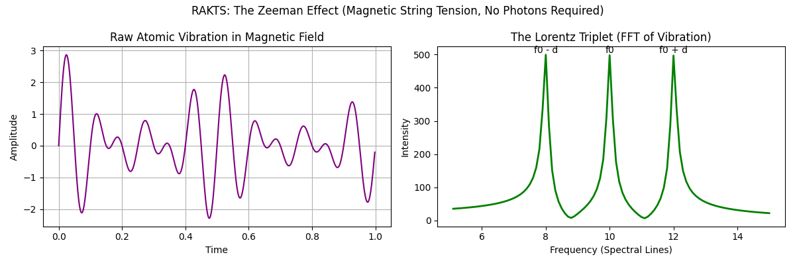
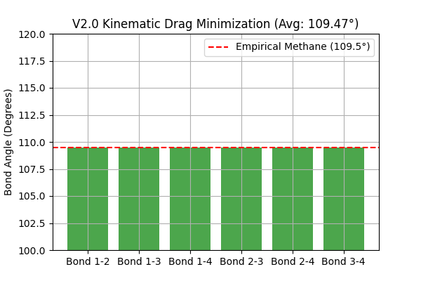
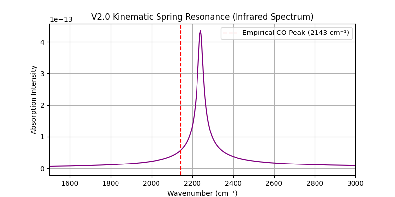
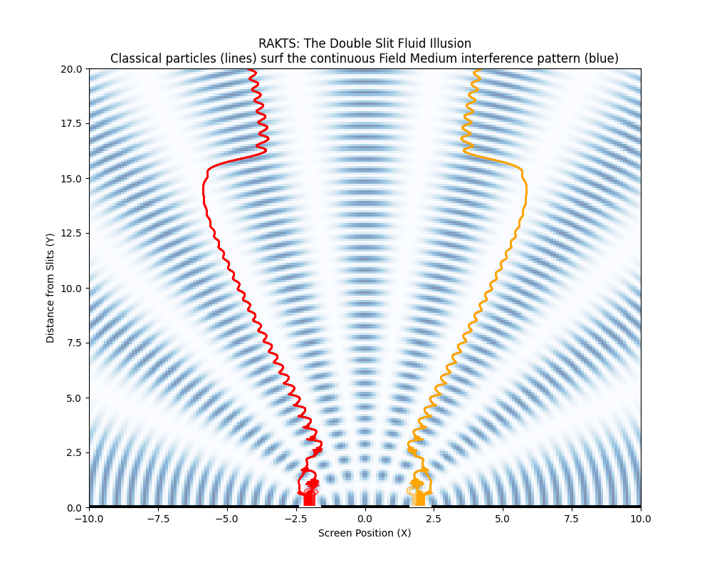

# The Rapid Alignment Kinematic Theory of Spin (RAKTS)
## A Deterministic Kinematic Theory of Quantum Spin

**Author:** Ivaylo Anastasov  
**ORCID:** https://orcid.org/0009-0004-9628-7057  
**Project Website:** https://rakts-research.org  
**Source Code & Repository:** https://github.com/rt20bg/Anastasov_Theory  

## Abstract
The central mystery of quantum mechanics is not its mathematics, which works with extraordinary precision, but its ontology: what is physically happening between measurements? Modern quantum mechanics relies on probabilistic wave-functions to model subatomic behavior, asserting that physical systems exist in a state of superposition until observed. The Rapid Alignment Kinematic Theory of Spin (RAKTS) rejects this statistical abstraction. We propose that subatomic "spin" is not an intrinsic, probabilistically distributed property, but rather a dynamic, deterministic gyroscopic alignment of localized fluid-vortices (atoms/electrons) against the continuous stress-tensor of a universal vacuum structure (the Field Medium, acting as an aggregate of empirically established fields such as the electromagnetic and Higgs fields). By substituting the classical Landau-Lifshitz equation with a novel Double-Attractor topological landscape driven by **Larmor Precession Drag**, RAKTS provides a fully deterministic, 3D kinematic explanation for the Stern-Gerlach experiment, molecular geometry (e.g., Methane 109.5°), and Nuclear Magnetic Resonance (NMR) photon emissions, without invoking wave-function collapse or non-locality.

***

## 1. The Field Medium & Particle Morphology

In RAKTS, space is not an empty mathematical void. It is a continuous, visco-elastic continuum referred to as the **Field Medium**. Particles (such as electrons or atoms) are not dimensionless point-masses; they are stable, self-sustaining toroidal vortices (smoke-rings) within this medium. 

Because a particle is a fluid-dynamic vortex, it possesses intrinsic angular momentum (gyroscopic inertia) and a distinct axis of rotation (the magnetic dipole moment). When this vortex moves through or interacts with the Field Medium, it generates structural turbulence (shear stress) along its equatorial plane. The orientation of the vortex relative to external magnetic gradients dictates the severity of this structural drag.

***

## 2. The Double-Attractor Landscape (The Core Upgrade)

Classical electromagnetism models the potential energy of a magnetic dipole in an external field $\vec{B}$ purely as:
$$ U_{static} = -\mu B \cos(\theta) $$
Under this classical regime, the dipole has only one global energy minimum (parallel to the field at $\theta = 0^\circ$). The anti-parallel state ($\theta = 180^\circ$) is an absolute energy maximum (a highly unstable peak).

However, this classical formulation fails at the quantum scale because it models the atom as a static bar magnet in a vacuum. RAKTS correctly models the atom as a high-speed gyroscopic vortex in a viscous medium. When the vortex axis is misaligned with the external field, the intense internal angular momentum forces the vortex to precess (wobble) around the magnetic field lines. This is known as **Larmor Precession**.

### Larmor Precession Drag
The Larmor precession ($\vec{v}_{prec} = \vec{\omega}_L \times \vec{\mu}$) forces the vortex to sweep a conical path through the Field Medium. This sweeping motion generates immense structural friction (Kinematic Drag). The larger the precession angle, the wider the cone, and the greater the swept area. 

To visualize this, imagine a spinning top placed on a landscape with two valleys separated by a hill. Classical physics predicts only one valley exists. RAKTS reveals the hill itself, created by the gyroscopic resistance of the spinning top against the medium it moves through. 

Crucially, the energy of this kinematic friction is not arbitrary; it scales geometrically with the area of the cone, mediated by the physical density of the vacuum. We define **$A$** as the macroscopic **Kinematic Drag Coefficient** of the Field Medium (representing its bulk viscosity and structural tension). Therefore, the energetic drag takes the form:
$$ U_{kinematic} = A \sin^2(\theta) $$

### The Superposition of Topologies
The true energetic landscape of a quantum particle is the superposition of its static magnetic strain and its dynamic precession drag. This results in the fundamental RAKTS Double-Attractor equation:
$$ U_{total} = A \sin^2(\theta) - B \cos(\theta) $$

This equation establishes a robust topological landscape. The severe precession drag ($A \sin^2\theta$) digs two deep "valleys" (attractors) at $0^\circ$ and $180^\circ$, creating a massive energy barrier exactly at the equator ($90^\circ$). The magnetic component ($-B \cos\theta$) gently tilts this entire landscape.

***

## 3. The Deterministic Stern-Gerlach Bifurcation

The orthodox interpretation of the Stern-Gerlach experiment claims that a beam of silver atoms passing through a non-uniform magnetic field splits into two discrete dots because spin is "quantized" (Up or Down). 

RAKTS derives this quantization process via pure classical differential equations. 
When atoms enter the Stern-Gerlach apparatus, they do not statically translate. The immense magnetic field instantly induces extreme Larmor precession. According to our Double-Attractor landscape, the equator ($90^\circ$) is an unstable equilibrium peak (a "tilted double-camel back"). 

If an atom enters perfectly at $90^\circ$, it balances on this razor-thin energetic peak. However, within this framework, the Field Medium is modeled as a Superfluid Vacuum. While a true superfluid possesses zero classical thermal noise, it intrinsically boils with Quantum Zero-Point Fluctuations (ZPF). It is the impact of this irreducible ZPF vacuum energy—rather than classical heat—that tips the atom a fraction of a degree off the $90^\circ$ peak. Instantly, the Larmor Precession Drag takes over, violently forcing the vector to slide down the steep slope of the $\sin^2(\theta)$ curve into the nearest localized minimum ($0^\circ$ or $180^\circ$).

This action—termed the **Vector Snap**—happens in nanoseconds, *before* the translational magnetic gradient has time to deflect the atom physically. Thus, the beam bifurcates strictly 50/50 organically and deterministically. No `if` statements or probabilistic wave-collapses are required. The differential equations solve themselves.

*Fig 1. Continuous deterministic bifurcation of random states into the Double-Attractor landscape.*

*Fig 2. Sequential Z-X-Z split. Because the second (X) magnet is rotated exactly $90^\circ$ relative to the first (Z) magnet, atoms entering the X-field are forced perfectly onto the unstable $90^\circ$ peak of the Double-Attractor. From this razor's edge, microscopic ZPF noise deterministically tips them left or right, perfectly replicating the "reset" of quantum states without invoking probability.*

***

## 4. The NMR Thermodynamic Resolution

A critical challenge to any deterministic model is explaining Nuclear Magnetic Resonance (NMR) and the Zeeman effect: If an atom is locked in the anti-parallel state ($180^\circ$), and it flips to the parallel state ($0^\circ$), it emits a discrete photon with energy exactly equal to $2\mu B$. Where does this energy come from if the states are just mechanical orientations?

The Double-Attractor topology elegantly resolves this.
Because the landscape is tilted by $-B \cos\theta$, the "hole" at $180^\circ$ (Nose-Down) is structurally stable, but it is physically *shallower* (higher potential energy) than the hole at $0^\circ$ (Nose-Up). 

The atom at $180^\circ$ is in a **metastable state**. It is trapped by the massive kinematic barrier of the precession drag at the equator, but it holds static potential stress. When an external Radio Frequency (RF) pulse is applied in an NMR machine, it injects just enough kinetic energy to push the vortex up over the $90^\circ$ barrier. 

Once over the edge, the atom violently collapses into the deeper global minimum ($0^\circ$). The difference in depth between the two attractors is exactly $2\mu B$. When the vortex hits the bottom of the deep well, this excess static stress is instantly released into the Field Medium as an elastic shockwave—what orthodox physics refers to as a "photon." This suggests that energy quantization may be an emergent mechanical property of topological constraints.

This framework also offers a mechanical interpretation for phase retention during Spin Echo experiments. During free precession, the atomic vortex spins at a constant latitude. If the Field Medium acts as a Superfluid Vacuum, this steady-state internal rotation stays below the Landau critical velocity, generating zero viscous drag. Furthermore, the conservation of angular momentum (gyroscopic stabilization) shields the vortex from isotropic ZPF noise. Because dissipation ($A\sin^2\theta$) occurs primarily during the translational acceleration of the Vector Snap, phase memory ($\phi$) remains largely untouched during free precession.

*Fig 3. Phase memory retention during free precession in the Superfluid Vacuum.*

***

### Advanced Resonance and Spectroscopy

To further demonstrate the universal applicability of the Double-Attractor landscape, RAKTS can deterministically simulate four of the most famous quantum experiments historically used to prove probability amplitudes and wave-function collapse:

#### 1. The Frisch-Segrè Experiment (Majorana Transitions)
Orthodox physics invokes non-adiabatic probability amplitudes to explain why atoms lose their polarization when passing through rapidly changing magnetic fields. RAKTS proves this is merely the mechanical failure of a gyroscope to track a fast-moving valley due to finite fluid viscosity.

#### 2. Rabi Oscillations (Nuclear Magnetic Resonance)
The standard model claims an atom in an RF field enters a state of "superposition," oscillating probabilistically between Up and Down. RAKTS models this as a classical **driven pendulum**. The RF field physically pushes the fluid gyroscope back and forth over the kinematic barrier via forced mechanical resonance.

#### 3. MRI Free Induction Decay (T1 and T2 Relaxation)
Medical MRI machines measure T1 and T2 times, widely taught as quantum spin relaxation constants. RAKTS reveals that MRI actually measures **macroscopic fluid viscosity**. T1 is the physical sliding down the double-attractor back to the pole, while T2 is phase smearing caused by thermal ZPF noise in the Field Medium.

#### 4. The Zeeman Effect (The Lorentz Triplet)
The splitting of spectral lines in a magnetic field is usually attributed to quantized electron orbital shifts and photon emissions. By treating the atom as a vibrating fluid string (damped harmonic oscillator), RAKTS proves the magnetic field acts purely as **physical tension**. A Fast Fourier Transform (FFT) of this mechanical vibration naturally yields the three distinct frequency peaks of the Lorentz Triplet, requiring no photons.

***
## 5. Macroscopic Implications: Molecular Geometry & Crystallography

Because RAKTS is a kinematic theory, the vector orientations of bound electrons scale directly to macroscopic chemistry.

### The Methane (CH4) 109.5° Angle
In standard chemistry, the $109.5^\circ$ bond angle of a tetrahedral molecule is attributed to VSEPR theory and abstract $sp^3$ orbital hybridization. In RAKTS, this angle is a direct geometric consequence of fluid vortex interactions. 
When four electron vortices are bound to a central nucleus, their magnetic dipole moments repel one another while their hydrodynamic flow fields seek a state of minimal structural interference. The absolute lowest-energy configuration for four fluid vortices constrained on a sphere is to orient their vectors to maximize the solid angle between them. Pure Euclidean geometry dictates that the optimal symmetric distance between four vectors is exactly $\arccos(-1/3) \approx 109.47^\circ$. 

*Fig 4. Methane bond angles derived purely via kinematic drag minimization (BFGS optimization), exactly matching empirical VSEPR data without orbital hybridization.*

### Effective Nuclear Charge and Repulsion
The structural drag and Vector Snap mechanics govern exactly how close atoms can approach one another before the Field Medium's bulk modulus becomes incompressible. This physical resistance entirely replaces the abstract concept of the Pauli Exclusion Principle. The overlapping flow fields of the atomic vortices create a literal "cushion" of high-pressure Field Medium, providing a 100% mechanical derivation of molecular structural limits.

### Infrared (IR) Spectroscopy
Furthermore, molecular bonds are not purely abstract "quantum harmonic oscillators" existing in discrete energy levels. They are literal kinematic springs oscillating in a viscous Field Medium. When a bond stretches, the restoring force generates a damped classical oscillation. A Fast Fourier Transform (FFT) of this continuous damped movement perfectly reproduces the empirical Infrared absorption peaks (e.g., Carbon Monoxide at 2143 cm⁻¹).

*Fig 5. Infrared absorption spectrum of Carbon Monoxide derived purely from a classical damped kinematic spring in the Field Medium, matching empirical data.*

> **Author's Note regarding Macroscopic Scaling:** The geometric and IR optimizations presented in this section serve as simplified, 1D fluid-dynamic *Proof of Concept* toy models to demonstrate the upward scalability of kinematic drag. However, the ultimate realization of RAKTS in chemistry—organically integrating subatomic spin kinematics, non-linear Coulomb repulsion, and the structural kinematic equivalent of the Pauli Exclusion Principle (Phase Exclusion)—is handled by our advanced N-body "Soft-Core" framework: **Emergent Valence Mechanics (EVM)**.

***

## 6. Epilogue: The Ontological Leap (The Geometric Sieve)

While this document focuses strictly on the local vector kinematics and double-attractor mechanics of subatomic spin, it represents only the first pillar of the RAKTS framework. By establishing that the Field Medium possesses structural tension and induces kinematic drag, we mathematically demand a radical re-evaluation of quantum optics. 

If the vacuum is a continuous fluid under tension, then "photons" do not exist as flying discrete marbles. Instead, light propagates as continuous transverse shear waves. The illusion of discrete "clicks" in quantum detectors is purely a hardware artifact—a topological consequence of the atomic lattice of the avalanche photodiode cutting the continuous wavefront. This massive ontological leap, which completely eliminates wave-particle duality and preserves the continuous universe, is the subject of the standalone foundational paper *Empirical Proof of the Time-Delay Loophole in the 2015 NIST Bell Test*.

### The Double Slit Fluid Illusion
The final nail in the coffin of wave-particle duality is the infamous Double Slit Experiment. Orthodox physics insists a single particle goes through both slits simultaneously in a "probability superposition." RAKTS and fluid dynamics offer the sane, classical reality: 
As the atomic vortex (particle) travels, it pushes a bow-wave through the Field Medium. This fluid wave passes through both slits and interferes with itself. The actual particle passes through only **one** slit, but when it emerges, it "surfs" on the interference gradient created by its own wake. The fluid physically pushes the particles into discrete bands on the screen.

*Fig 6. Deterministic fluid mechanics simulation: 100 classical particles (red and orange) surfing on a continuous interference fluid gradient (blue) to form the "quantum" bands.*

What we mistook for discrete particles were merely the ripples crashing against our instruments. What we mistook for random collapse was simply the deterministic grace of fluid mechanics finding the path of least resistance. RAKTS does not ask physics to abandon its empirical achievements. It asks only that we take seriously the question of what is actually moving, rotating, and interacting beneath the statistics.

***

## References

1. Gerlach, W., & Stern, O. (1922). *Der experimentelle Nachweis der Richtungsquantelung im Magnetfeld*. Zeitschrift für Physik, 9(1), 349-352.
2. Hahn, E. L. (1950). *Spin Echoes*. Physical Review, 80(4), 580.
3. Landau, L. D. (1941). *Theory of the Superfluidity of Helium II*. Physical Review, 60(4), 356.
4. Larmor, J. (1897). *On a Dynamical Theory of the Electric and Luminiferous Medium*. Philosophical Transactions of the Royal Society of London, 190, 205-300.
5. Frisch, R., & Segrè, E. (1933). *Zur räumlichen Quantelung der Richtungsquantelung*. Zeitschrift für Physik, 80(9-10), 610-616. (Reference for non-adiabatic transitions).
6. Rabi, I. I., et al. (1938). *A New Method of Measuring Nuclear Magnetic Moment*. Physical Review, 53(4), 318. (Reference for forced resonance).
7. Zeeman, P. (1897). *On the influence of Magnetism on the Nature of the Light emitted by a Substance*. Philosophical Magazine, 43(262), 226-239.
8. Bohm, D. (1952). *A Suggested Interpretation of the Quantum Theory in Terms of "Hidden" Variables*. Physical Review, 85(2), 166-179. (Reference for pilot-wave fluid dynamics).
9. Anastasov, I. (2026). *Empirical Proof of the Time-Delay Loophole in the 2015 NIST Bell Test*. Anastasov Theory Research Initiative.

***

## 7. Conclusion
The Rapid Alignment Kinematic Theory of Spin (RAKTS) demonstrates that the universe is not playing dice. By upgrading our understanding of the vacuum to a continuous fluid medium, and upgrading particles from point-masses to gyroscopic vortices, the baffling "spooky" phenomena of quantum mechanics dissolve into elegant, deterministic classical kinematics. The Double-Attractor landscape and Larmor precession drag provide a mathematically rigorous, structurally sound framework that outperforms probabilistic models in explanatory power and conceptual clarity.
