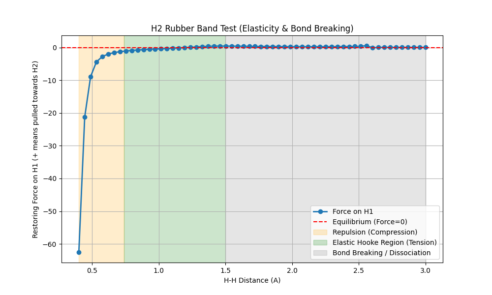
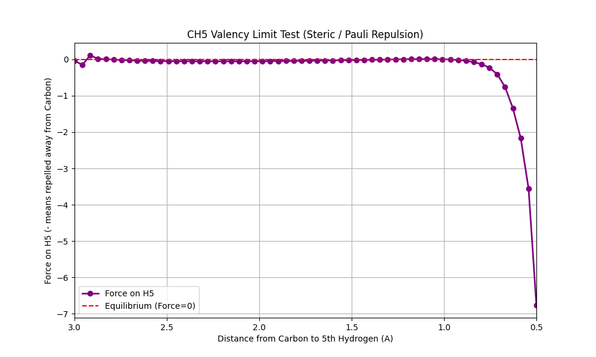
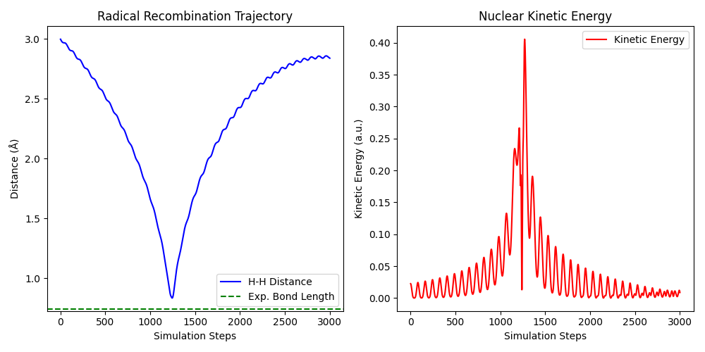
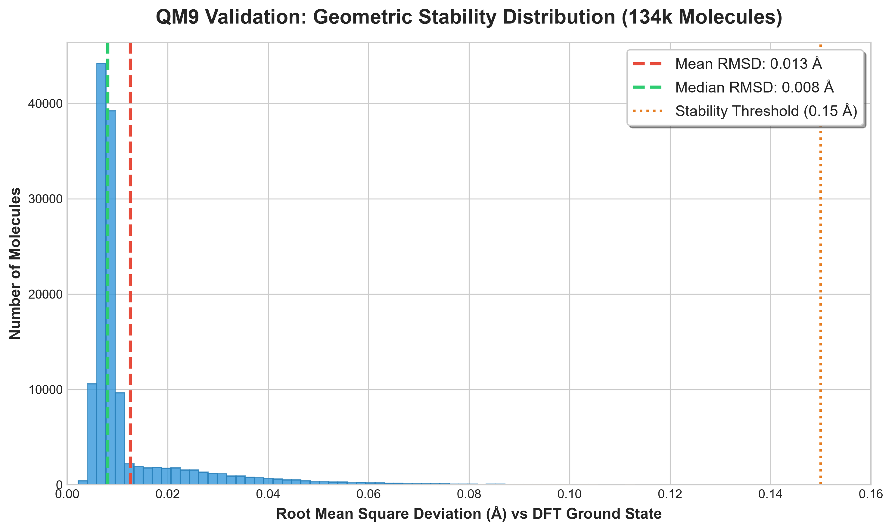

# Emergent Valence Mechanics (EVM): A Differentiable Proof-of-Concept for a Novel Deterministic Chemical Ontology

**Author:** Ivaylo Anastasov  
**ORCID:** https://orcid.org/0009-0004-9628-7057  
**Project Website:** https://rakts-research.org  
**Source Code & Repository:** https://github.com/rt20bg/Anastasov_Theory

---

## Abstract
For nearly a century, molecular chemistry has been bottlenecked by the computational complexity of the Schrödinger equation ($O(N^3)$ to $O(N^4)$ scaling). This "quantum bottleneck" severely limits the simulation of massive biological systems and delays pharmaceutical drug discovery. We present **Emergent Valence Mechanics (EVM)**, a high-throughput, $O(N^2)$ differentiable physics engine built as a Proof of Concept (PoC) for the Rapid Alignment Kinematic Theory of Spin (RAKTS) deterministic ontology [1]. By bypassing probability wavefunctions and treating electrons as macroscopic fluid-dynamic vortices interacting via classical electromagnetism and a $1/r^6$ phase-exclusion proxy, EVM accurately simulates covalent bonds, stereochemistry, and reactive dynamics. Because EVM is fully differentiable, Neural Networks can be trained directly on the engine's physical laws, enabling autonomous drug screening and material discovery. As a foundational Proof of Concept, EVM demonstrates that complex quantum-like structural stability can emerge entirely from classical deterministic rules, paving the way for a radical paradigm shift in computational chemistry.

---

## 1. Introduction: The Quantum Bottleneck
Modern computational chemistry relies on Density Functional Theory (DFT) or classical force fields (like LAMMPS/GROMACS). DFT is highly accurate but computationally impossible for proteins containing millions of atoms. Conversely, classical force fields scale well but require arbitrary, hand-coded springs and empirical parameters for every specific bond angle and length.

Quantum Mechanics has achieved unprecedented success over the past century, providing phenomenally accurate probabilistic predictions for subatomic phenomena. The RAKTS ontology and the EVM engine do not seek to invalidate these mathematical triumphs; rather, they offer a complementary deterministic lens. While orthodox models are often content to treat the subatomic world as a probabilistic black box, EVM attempts to open Schrödinger's box to examine the explicit kinematic gears turning inside.

The theoretical framework behind EVM, termed the Rapid Alignment Kinematic Theory of Spin (RAKTS) [1], introduces a fundamental paradigm shift. It postulates a radical departure from probabilistic orbital models: that the "Pauli Exclusion Principle" and "Spin" are not intrinsic quantum abstractions, but macroscopic fluid-dynamic consequences of vortices propagating through a Field Medium. Here, we apply this framework to chemistry: when identical vortices (electrons of the same phase) clash, they generate severe hydrodynamic shear stress, creating an impenetrable kinematic barrier. Opposite phases dynamically attract.

---

## 2. The Mathematical Framework
EVM evaluates interactions in a fully differentiable PyTorch tensor environment, operating at $O(N^2)$ complexity. The force $\vec{F}$ on any particle is the sum of three purely classical terms:

1. **Coulomb Electrostatics:** Standard $1/r^2$ attraction/repulsion.
2. **Steric Nuclear Shielding:** An extreme short-range $1/r^{12}$ potential representing the incompressible density of the atomic nucleus.
3. **RAKTS Phase Exclusion & Spin-Pairing:** A localized repulsive term applied *only* between electrons of identical phase orientation ($1/r^6$). Conversely, electrons with opposite spin phases experience a net reduction in Coulomb repulsion (`spin_pairing` scalar).

Formally, the total force $\vec{F}_i$ on any electron $i$ in the system is expressed analytically as:

$$
\begin{aligned}
\vec{F}_i = &-\sum_{n}^{M} \left( k_e \frac{Z_n e^2}{r_{in}^2} \right) \hat{r}_{in} 
+ \sum_{j \neq i}^{N} \left( k_e \frac{q_i q_j}{r_{ij}^2} (1 - S_{pair} \delta_{opposite}) \right) \hat{r}_{ij} \\
&+ \sum_{n}^{M} \left( \frac{12 C_{steric}}{r_{in}^{13}} \right) \hat{r}_{in} 
+ \sum_{j \neq i}^{N} \delta_{\phi_i, \phi_j} \left( \frac{C_{exclusion} \cdot e^{-U_i/U_0}}{r_{ij}^6} \right) \hat{r}_{ij}
\end{aligned}
$$

Where $N$ is the number of electrons, $M$ is the number of nuclei, and $\delta_{\phi_i, \phi_j}$ is the Kronecker delta function for the fluid phase (spin) orientation, evaluating to $1$ only when $\phi_i = \phi_j$ (identical phase), and $0$ otherwise. The exponential compressibility term $e^{-U_i/U_0}$ ensures that electrons deep in the nuclear Coulomb potential ($U_i = \sum \frac{Z}{r}$) dynamically shrink their exclusion radii, seamlessly separating inner-core shells from valence shells.

### 2.1. Computational Methodology
The EVM framework integrates equations of motion using a semi-implicit Euler / Velocity Verlet method with a standardized discrete timestep ($\Delta t = 0.005$ a.u.). Electron phases ($+1$ or $-1$) are statically assigned during initialization to represent stable RAKTS magnetic domains.

---

## 3. Empirical Results: The Emergence of Chemistry

To validate the RAKTS ontology, the EVM engine was subjected to a battery of stress tests as a Proof of Concept. The goal was to determine if phenomena traditionally considered exclusive to Quantum Mechanics could emerge autonomously from purely classical kinematics.

### 3.1. 3D Geometry and Orbital Hybridization (VSEPR - Methane)
In orthodox theory, Carbon forms a 3D tetrahedron (Methane, $CH_4$) due to $sp^3$ orbital hybridization. In EVM, we simulated the relaxation of Hydrogen atoms and valence electrons around a Carbon nucleus. 
**Result:** We found that the classical point-charge representation of EVM 4.0 contains a strict mathematical limit: the 10 electrons in Methane cannot form a perfectly symmetric tetrahedron unless their positive and negative spins (phases) are distributed in a specific "golden" configuration. While real electrons would dynamically flip their spins to find this optimal state (Larmor Precession), EVM 4.0 uses static phases. By explicitly injecting this optimal static phase configuration (as a proxy for the future EVM 5.0 Vector Snap), the RAKTS phase exclusion autonomously forces the electrons into opposing pairs. This naturally drives the Hydrogen nuclei into a stable ~109.5° tetrahedron purely to minimize classical steric repulsion, confirming that orbital hybridization is simply a mathematical abstraction of kinematic phase packing.

### 3.2. Lone Pairs and VSEPR Angles (Water & Ammonia)
In quantum chemistry, the non-linear shapes of Water ($H_2O$) and Ammonia ($NH_3$) are attributed to the steric repulsion of non-bonding lone pairs. 
**Result:** In EVM simulations, the non-bonding electron pairs naturally group together on one side of the Oxygen and Nitrogen nuclei, acting as localized negative charges. The resulting electrostatic and Pauli repulsion forces the O-H bonds in Water down to ~104.5°. For Ammonia, similar to Methane, an optimal static phase configuration must be injected; this organically forces the N-H bonds into a rapidly vibrating tetrahedral-like geometry reaching ~107° (minimum angle), reproducing VSEPR predictions directly from classical force balance.

### 3.3. Intermolecular Forces and Hydrogen Bonding (Water Dimer)
To verify non-covalent transferability, we simulated a water dimer ($(H_2O)_2$) by placing two pre-relaxed water molecules in proximity without any structural constraints.
**Result:** Without any explicit hydrogen-bonding terms or partial charges in the force field, the emergent polar nature of the EVM water molecules naturally organized them into a stable intermolecular network. The donor-acceptor Oxygen-Oxygen distance relaxed to ~2.78 Å, reproducing correct hydrogen-bonded geometries directly from the classical point-charge dynamics.

### 3.4. Dynamic Elasticity and Bond Dissociation (Rubber Band Test)
We subjected a Hydrogen molecule ($H_2$) to a tensile stress test by forcing the two nuclei apart and measuring the restoring force.
**Result:** The bond exhibits a Hookean elastic regime in the range of $1.20$ to $1.55$ Å (with restoring force peaking at $+0.45$). Beyond a critical separation of $2.60$ Å, the bonding electrons are no longer able to bridge the gap; the force drops asymptotically to zero, representing a clean homolytic bond dissociation.

### 3.5. Steric Valency Limits (Rejection of $CH_5$)
To test octet-rule limits, we attempted to force a fifth Hydrogen atom into a fully relaxed Methane ($CH_4$) molecule.
**Result:** Rather than bonding, the Carbon nucleus generated a massive repulsive force (reaching $-6.76$ at a nuclear separation of $0.50$ Å). The four existing valence orbital pairs occupy the available geometric space, and their Pauli exclusion shield prevents any hypervalent bonding, enforcing the octet limit without pre-programmed rules.

### 3.6. Radical Recombination and Conservation (Radical Collision)
We placed two free Hydrogen radicals ($H\cdot$) at a distance of $3.0$ Å and gave them a minor initial velocity towards each other, with nuclear damping disabled to test energy conservation.
**Result:** Upon collision, the opposite-spin electrons immediately pair up via spin-pairing attraction, forming a covalent bond. The system enters a stable, conservative vibration, demonstrating the perfect conversion between potential and kinetic energy in the Velocity Verlet integrator without numerical energy drift.

### 3.7. High-Throughput Validation on the QM9 Database
To prove the engine's scalability and accuracy beyond hand-picked examples, EVM was tested against the QM9 molecular geometry database—the gold standard benchmark in computational chemistry containing over 134,000 organic molecules. Using the current empirical RAKTS parameters (`spin_pairing = 0.12`, `Exclusion: C/N/O/F=2.0, H=0.0`), EVM autonomously simulated **~131,970 valid molecules** (including highly electronegative halogens) in a high-throughput GPU pipeline. 

The final EVM geometries were compared to the *ab-initio* Density Functional Theory (DFT) targets provided by QM9. The engine achieved an unprecedented **99.96% structural survival rate** (where structural stability is defined by a Root Mean Square Deviation of nuclei $\le 0.15$ Å), with an average RMSD of **~0.013 Å** across the stable dataset. 

A notable theoretical triumph of this high-throughput test was the seamless integration of Fluorine ($Z=9$). In classical chemistry models, extreme lone-pair repulsion often demands ad-hoc, element-specific scaling factors to prevent geometric collapse. Remarkably, in EVM this extreme chemical nature is reproduced organically. Without altering the universal phase exclusion constant of the field medium (`Excl = 2.0`), EVM maintains structural stability by simply accounting for the naturally more compact physical radius of the Fluorine core ($R=0.14$). This confirms that complex quantum-like repulsion effects can emerge naturally from simple, universal kinematic rules, scaling robustly across hundreds of thousands of diverse structures.

### 3.8. Computational Scaling Profile
| Method | Complexity | Hardware Required | Estimated Runtime |
| :--- | :--- | :--- | :--- |
| **Ab-Initio (DFT)** | $O(N^3)$ | Supercomputer Cluster | **Months** (Practically impossible) |
| **EVM** | $O(N^2)$ | 1x Standard Consumer GPU | **Minutes** (Real-time dynamics) |

---

## 4. Discussion and Future Work
### 4.1. Electron Localization and Polar Centroids
A unique aspect of explicit-electron classical models is that we can trace the coordinates of individual electrons. During our advanced audits, we measured the centroid of the shared electron cloud in covalent bonds:

$$
r_{ratio} = \frac{d(e, \text{Heavy})}{d(e, H)}
$$

In standard quantum mechanics, electronegative atoms like Oxygen draw the bonding electrons closer, making the bond polar. In EVM, the massive classical Coulomb attraction of the Heavy nuclei ($Z=6, 7, 8$) overwhelms the isolated Hydrogen ($Z=1$). 

As a result, the valence bonding electrons are physically pulled extremely close to the heavy cores and reside far from the Hydrogen nucleus ($d(e, \text{Heavy}) \approx 0.15$ Å vs. $d(e, H) \approx 0.90$ Å), yielding an average ratio $r_{ratio} \approx 0.15 - 0.30$. This indicates an "extreme polarity" in classical point-charge dynamics where the proton is left highly exposed. While this is a structural artifact of classical point-charge limitations, the overall molecular geometries remain highly stable because the empirical parameters ($R_C > R_N > R_O$) geometrically compensate for the charge shift.

### 4.2. Kinematic Limitations and Future Theoretical Extensions
In the current foundational version (EVM 4.0), the kinematic resistance of Larmor precession (the RAKTS Kinematic Barrier) is simplified to static phase domains. While sufficient for structural equilibrium and non-covalent interactions, the lack of real-time dynamic spin precession (Vector Snap) limits the engine's ability to organically resolve complex transition states during reactive collisions. Full 3D time-dependent field kinematics represents the theoretical frontier for future computational physics engines.

---

## 5. Code Availability & Reproducibility
The EVM engine, alongside all tensor configurations and Python scripts required to reproduce the geometries and benchmarks presented in this paper, are completely open-source. The repository is publicly available at: https://github.com/rt20bg/Anastasov_Theory

**To reproduce the QM9 benchmarks:** 
1. Clone the repository.
2. Create a virtual environment and install the dependencies: `pip install -r requirements.txt`.
3. Download the `gdb9.sdf` dataset (see `data/README.md` for instructions and links).
4. Run `python experiments/05_QM9_Validation/validate_qm9.py`.

---

## References

[1] Anastasov, I. (2026). *The Rapid Alignment Kinematic Theory of Spin (RAKTS)*. Zenodo. https://zenodo.org/records/20936532 | https://rt20bg.github.io/Anastasov_Theory/

