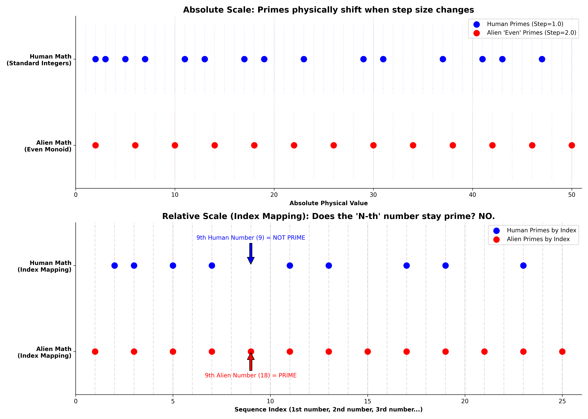

# The Relativity of Prime Numbers: Grid-Dependent Distributions and Cryptographic Applications

## Abstract
For centuries, mathematics has revered prime numbers as the fundamental, unbreakable "atoms" of reality. Enormous computational power and human intellect are expended mapping their chaotic distribution. However, this paper proposes a paradigm-shifting perspective: prime numbers are not intrinsic properties of the universe, but rather optical illusions created by an arbitrary measurement system. We argue that the universe operates as an analog, continuous spectrum, and the anomalies we observe as "primes" are merely artifacts of an artificially imposed "Step 1.0" integer grid.

## 1. The Trap of the "Step 1.0" Grid
The entire foundation of number theory, and prime numbers specifically, relies on an anthropocentric and unproven assumption: that reality fundamentally counts in rigid, discrete steps of exactly 1.0. Because humans evolved with ten fingers, we constructed a mathematical framework based on distinct whole integers: 1, 2, 3, 4, etc. 

Within this framework, a prime number is defined simply as a number that cannot be evenly divided by any other whole number except 1 and itself. However, this definition is tautological—it only holds significance because we mandated the existence of the 1.0 grid in the first place.

Consider laying a rigid, square metal grid over a flowing, continuous river. The grid represents our integer-based mathematics. The continuous flow of the water represents the energetic reality of the physical universe. In this analogy, prime numbers are not magical points of power within the water; they are simply the awkward, mathematically irreducible spots where the rigid squares of the grid fail to cleanly intersect with the natural waves. They are not emergent properties of nature; they are the friction points of a poorly chosen coordinate system applied to a dynamic medium.

## 2. Extraterrestrial Epistemology: The Relativity of Counting
To understand the arbitrary nature of our prime numbers, we must engage in an epistemic exercise. Consider an advanced extraterrestrial civilization that evolved in a different physical environment. Suppose their cognitive architecture naturally led them to base their mathematics on a fundamental step size of exactly 0.96 (relative to our base 1), or perhaps they inherently count in increments of what we call 2: 2, 4, 6, 8...

If an alien species counts with a base unit of 2, their "integers" are our even numbers. In their reality, what we call the number 3, they would conceptualize as a bizarre decimal or fraction (1.5 in their units). Their concept of "indivisibility" would fundamentally shift. Our prime numbers would completely disappear from their mathematical foundation. Depending on their chosen baseline, their primes would fall in entirely different locations, or the very concept of a "prime number" might never emerge in their civilization.

This does not mean that if an alien species counts 2-4-6, there are no instances of "3 apples" in nature. The apples physically exist. But the alien mathematics would describe that quantity not as a fundamental, "holy" integer, but as an intermediate, fractional state. The property of being "prime" is wholly dependent on where you place the zero and how wide you draw the step size. It is a relative coordinate, not an absolute truth.

### 2.1 The Mathematical Demonstration: The "Even-Stepper" Alien Monoid
To mathematically demonstrate that prime numbers can be viewed as relative artifacts, we can examine advanced algebra, specifically Generalized Primes (or Hilbert Monoids). 

Consider an alien civilization that operates exclusively on an even-numbered grid: $$\{2, 4, 6, 8, 10, 12...\}$$

In their mathematics, a "prime number" is defined exactly as ours is: a number that cannot be formed by multiplying two other valid numbers in their grid. Let us attempt to multiply in their universe:
* $$2 \times 2 = 4$$ (Therefore, 4 is composite).
* $$2 \times 4 = 8$$ (Therefore, 8 is composite).
* $$2 \times 6 = 12$$ (Therefore, 12 is composite).

But what about the number **6**? To create 6 via multiplication, they would need to multiply $$2 \times 3$$. However, the number 3 *does not exist* in their mathematical grid. Consequently, the number 6 functions as a prime in their mathematical system. It cannot be factored within that specific monoid.

Thus, in this alien counting system, the Prime Numbers are: **2, 6, 10, 14, 18, 22...** (Mathematically, every number of the form $$4k+2$$). 

### 2.2 The Index Mapping Illusion
One might object: *"Even if the absolute numbers change, perhaps the primes still fall on the exact same relative sequence index? Perhaps the 3rd number is always prime, regardless of the grid?"*

Let us test this hypothesis by mapping the "N-th" number in both sequences:
* **Human Sequence (Step 1.0):** 1, 2, 3, 4, 5, 6, 7, 8, 9...
* **Alien Sequence (Step 2.0):** 2, 4, 6, 8, 10, 12, 14, 16, 18...

Look closely at the **9th number** in each sequence:
* The 9th Human number is **9**. (Composite: $$3 \times 3$$).
* The 9th Alien number is **18**. (Prime! Because $$18 = 2 \times 9$$, and 9 does not exist in their universe. $$4 \times X \neq 18$$. $$6 \times 3$$ is invalid because 3 doesn't exist.)

The "holes" do not match up by sequence index. In the human sequence, primes become increasingly rare as numbers grow. In the Even-Stepper alien sequence, *every odd index is a prime number*, resulting in a prime density of exactly 50% extending to infinity.

This mathematical demonstration suggests that by altering the grid step from 1.0 to 2.0, the distribution of primes shifts entirely—both in absolute physical value and in relative sequence index. This provides a compelling argument that primes may not be fundamental universal constants, but rather dynamic properties dictated strictly by the baseline unit of the observer's coordinate system.

## 3. The Fallacy of "Natural" Numbers: Pi vs. Three
Mainstream mathematics refers to positive integers (1, 2, 3...) as the "Natural Numbers" because humans can conceptually hold 3 apples in their hand. But this is a limitation of human biological hardware and macroscopic perception, not a fundamental law of physics.

At the quantum and cosmological levels, the universe does not operate in whole threes. It operates in waves, gradients, frequencies, and pressure differentials. Consider the constant Pi ($$\pi \approx 3.14159...$$). In nature, Pi is infinitely more "natural" than the number 3. Everywhere energy propagates, bends, curves, or orbits, Pi is fundamentally present. The number 3, on the other hand, is merely a rounded-down, low-resolution approximation of reality.

In a purely analog, continuous universe, the exact integer "3.00000000... (to infinity)" practically does not exist. It is a mathematical abstraction. In reality, any physical manifestation of "3" is actually 3.00000001 or 2.99999999. The exact integer 3 is just as statistically rare and arbitrary as any highly specific irrational number. We have digitized nature so our brains could comfortably process it into separate objects, and in our arrogance, we mistook this digital compression format for the fundamental source code of reality.

## 4. Practical Applications: Defeating Quantum Decryption via Dynamic Grids
Modern digital security infrastructure, primarily RSA encryption, relies heavily on the factorization of massive prime numbers. It operates on the premise that it is easy to multiply two primes, but incredibly computationally intensive to factor them back out. 

However, this entire paradigm forces both the encrypter and the hacker to play on the exact same 1.0 integer grid. The looming threat of Quantum Computers (specifically Shor's Algorithm) relies entirely on this fact: quantum states can rapidly scan the standard 1.0 integer grid to find the prime factors, rendering current encryption obsolete in the near future.

If we approach primes as a relative property of the grid's step size, an alternative cryptographic paradigm emerges: **Dynamic Grid Cryptography (DGC)**.

### 4.1 The DGC Protocol
Instead of relying on standard primes, a DGC system encrypts data using "Alien Primes" generated from a mathematically shifted, non-standard grid (e.g., an Even-Stepper monoid, or an irrational step like $$0.96347... \times \pi$$). 

1. **The Key is the Ruler:** The secret key is no longer just a large number; the secret key is the *exact grid step size* and the *monoid ruleset*.
2. **Encryption:** The message is encrypted using primes valid *only* within that specific mathematical dimension.
3. **The Quantum Trap:** A quantum computer attempting to brute-force the code using standard base-10 integer mathematics will process pure statistical noise. It will hunt for standard primes, but the data is locked by a prime that only exists in a different grid dimension (e.g., attempting to factor a number that is only prime when the step is 2.0).

You cannot brute-force a prime factorization if you do not know the exact length of the "ruler" the system used to define what a prime is. Brute-forcing RSA is like trying to guess the combination of a padlock; attempting to crack DGC without the baseline grid is like trying to guess the exact atmospheric pressure of a sealed room on another planet. By utilizing shifting algebraic baselines, we can propose a cryptographic standard that offers significant resilience against standard integer-based quantum factorization algorithms.

## 5. The Verdict
The mathematics surrounding prime numbers is undeniably brilliant, but it may ultimately be the study of the anomalies within our own numerical grid, rather than a study of fundamental universal constants.

When we drop the anthropocentric assumption that reality is strictly sliced into neat, human-sized blocks of 1.0, the mysteries become clearer. The shifting distribution of primes and the vulnerabilities of integer-based digital codes both point to a pragmatic conceptual shift:

The universe doesn't count. It flows. We may understand it far better when we stop trying to force the analog water of reality exclusively into the rigid, square boxes of our counting numbers.

## 6. Philosophical Postscript: A Note on Complex Analysis
As an avenue for further theoretical consideration, this analog perspective might offer a gentle philosophical lens through which to view complex analysis in number theory. 

Modern analytical number theory often utilizes complex (imaginary) numbers to map the distribution of primes. One might philosophically ask: why does mapping discrete integers require imaginary numbers? If we view reality as fundamentally analog, it suggests that standard mathematics is attempting to describe a continuous wave using discrete, rigid pixels (whole integers). 

In this speculative view, the complex, imaginary components used in advanced mathematical functions act as a necessary conceptual bridge—a mathematical algorithm applied to smooth out the friction between an artificial integer grid and the continuous, wave-like reality of the physical vacuum. It is an interesting philosophical thought that the intricate patterns found in complex analysis are not merely secrets of the primes themselves, but rather the natural resonant axis of a continuous medium mathematically asserting itself over the rigid framework of our integer coordinate system.
